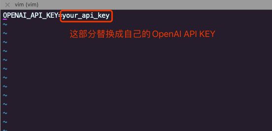
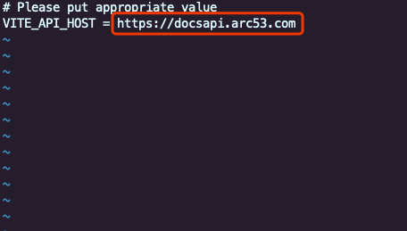
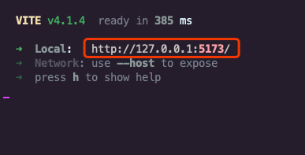
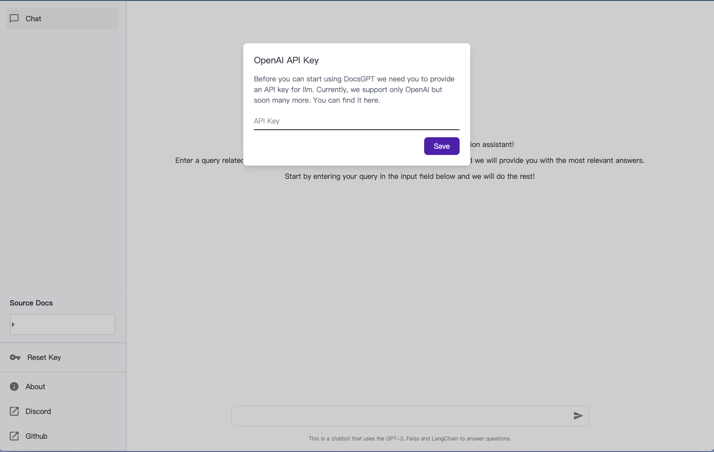
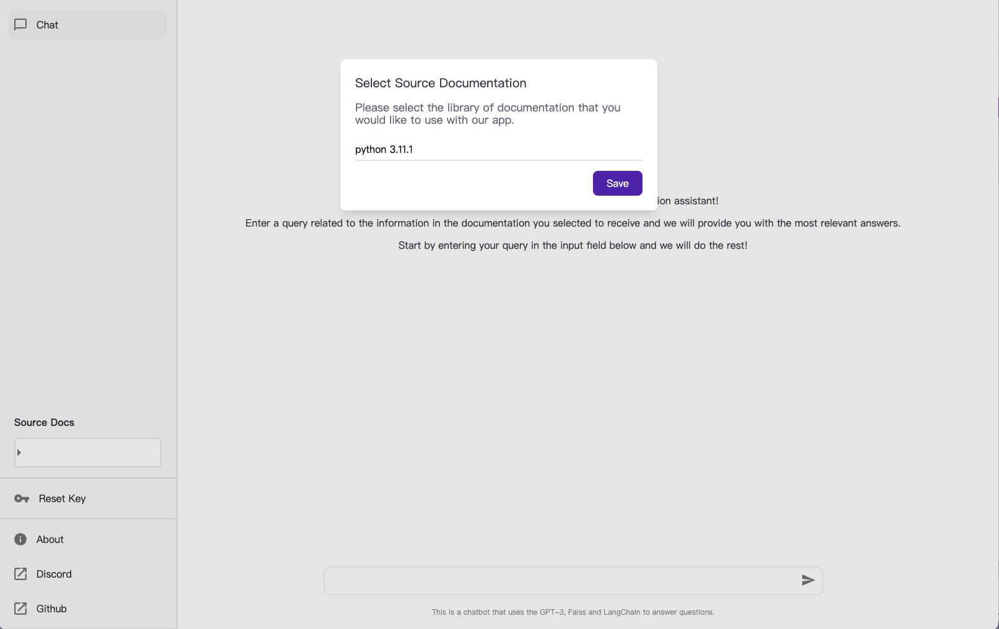
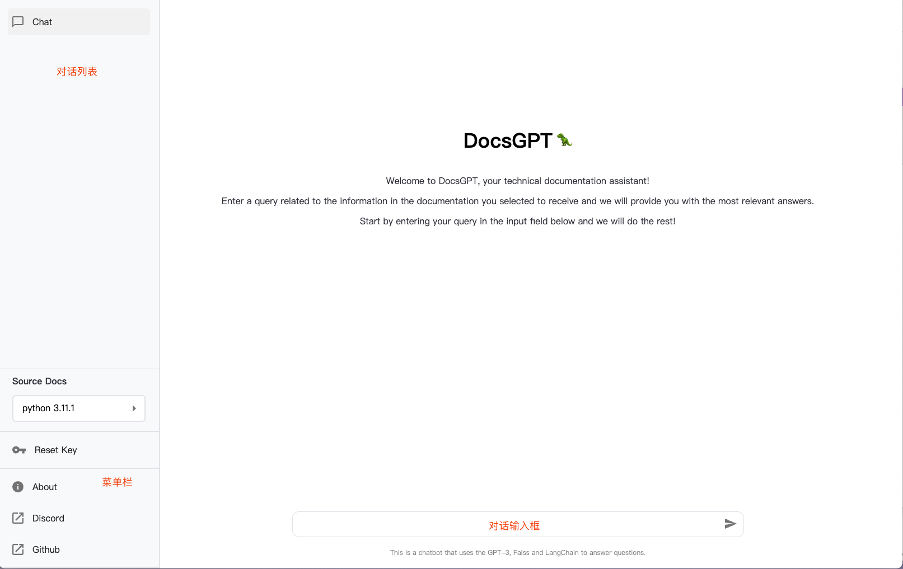
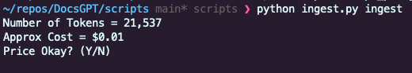
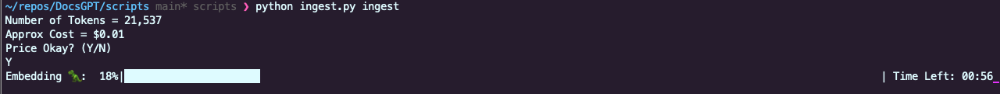
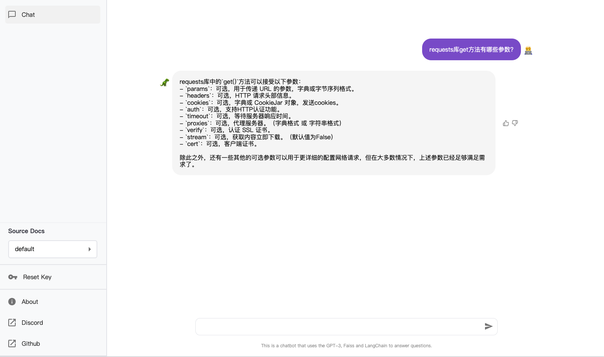

# DocsGPT

基于企业内部独有的知识库，进行智能的客服问答，毫无疑问是 ChatGPT 出圈以后，所有公司想要融入 ChatGPT 技术时的第一反应。可惜 ChatGPT 实际上是一个基于大语言模型实现的，包括很多其他功能的，完整的聊天产品。并没有直接的接口让用户导入完整的知识库。

此外，openai 提供的 GPT3 接口服务，也必须一直联网使用。对部分传统的 toB 服务产品依然不太友好。有趣的是，业界似乎也都不推荐使用 GPT3 的 fine-tuning 方式，甚至据说 fine-tuning 方式加入新训练数据后反而会导致通用文本的生成能力下降。

DocsGPT 开源项目，针对这种情况，采用 GPT3 接口，配合 faiss 向量搜索引擎和 langchain 模型库，快速实现了一个针对技术文档的智能客服。可以作为这类产品的基础原型，供大家参照。项目地址是<https://github.com/arc53/DocsGPT>

首先，我们把这个项目clone到本地，DocsGPT项目分为后台服务和前台页面两部分，当我们进入项目文件夹后，`/application` 文件夹中是后台服务的相关代码，使用python语言编写，`frontend`文件夹中则是前端页面的相关代码，编译前端文件需要预先安装nodejs。

我们首先启动后台服务：进入 `/application` 文件夹，然后使用命令 `pip install -r requirements.txt` 安装好依赖。复制 .env_sample 文件为 .env 文件，编辑文件，把文件中的 yout_api_key替换成自己的 OpenAI API 的 API key。

然后执行 `python app.py` 命令启动后台服务，服务默认使用 5001 端口。

接下来我们编译前端页面，回到项目根目录，进入`frontend` 文件夹下，使用 `npm install` 安装依赖，将 `.env.development` 文件中 `VITE_API_HOST` 的地址从 `https://docsapi.arc53.com` 改为刚才启动的后台服务地址 `http://localhost:5001`:

最后使用 `npm run dev` 命令启动前端页面服务。

这个时候，页面和后台服务都启动完成了，我们去浏览器中看看效果吧！打开浏览器，输入前台页面启动时终端窗口提示的地址 `http://127.0.0.1:5173/`，我们就打开了DocsGPT的主页面。

刚进入界面，会提示我们输入 OpenAI API Key，

输入以后会提示我们选择使用哪个已经训练好的文档，这里我们选择python3.11.1作为文档数据源，然后点击 Save 按钮保存。

这个时候我们就能完整的看到 DocsGPT 的交互页面了，我们会发现，这个页面和 ChatGPT 的对话页面长得非常相似，功能区域划分也是一致的。左侧导航栏分为对话列表和菜单两部分，右侧为对话主界面，主界面的下部正中间为聊天对话输入框。

由于我们还没训练自己的文档，所以现在也查不出什么内容，接下来我们先自己训练一份文档看看效果。DocsGPT支持的用于训练的文档格式还是很多的，基本囊括了市面上文档所涉及的各种格式：.rst, .md, .mdx, .pdf, .docx, .csv, .epub, .html，我们用python的一个非常好用的库 requests 的文档举个例子，看看训练以后在DocsGPT中能有什么表现。

首先将 requests 这个库下载到本地，在 DocsGPT 项目的 `scripts/` 目录下创建名为`inputs` 的文件夹，并requests的文档文件拷贝到这个目录下，由于DocsGPT在训练时是递归查找文档文件的，所以我们不必将所有文件平铺。

接下来我们回到`scripts/`目录并创建一个.env文件，如同之前一样，把 OpenAI API Key 更新到文件中对应的位置，`OPENAI_API_KEY=API Key`。接着我们运行`pip install requirements.txt` 安装训练所需依赖，安装完成后运行 `python ingest.py ingest` 命令开始训练。当然，因为训练使用了OpenAPI的 `gpt-3.5-turbo` 模型生成矢量数据，所以需要花费一定的金额，具体的金额在命令执行完token切分的时候，会在终端提示，我们选择同意后才会真正扣费并进行训练和生成矢量数据库数据文件。

我们选择 `Y` 以后，稍等片刻就会出现训练进度条。

等待训练完成以后我们发现`scripts/`目录下出现`outputs/inputs/`目录，进入目录后我们就能看到新生成的 .faiss 为后缀的矢量数据文件以及 .pkl 后缀的索引文件。我们将这两个文件复制到项目根目录下的 `application/` 文件夹下，替换原有同名文件，然后在 `application/` 文件夹下重新启动后台服务。这个时候我们就可以去页面上看看效果了！

这样，我们就利用DocsGPT搭建完成了一个问答式的文档检索服务。

