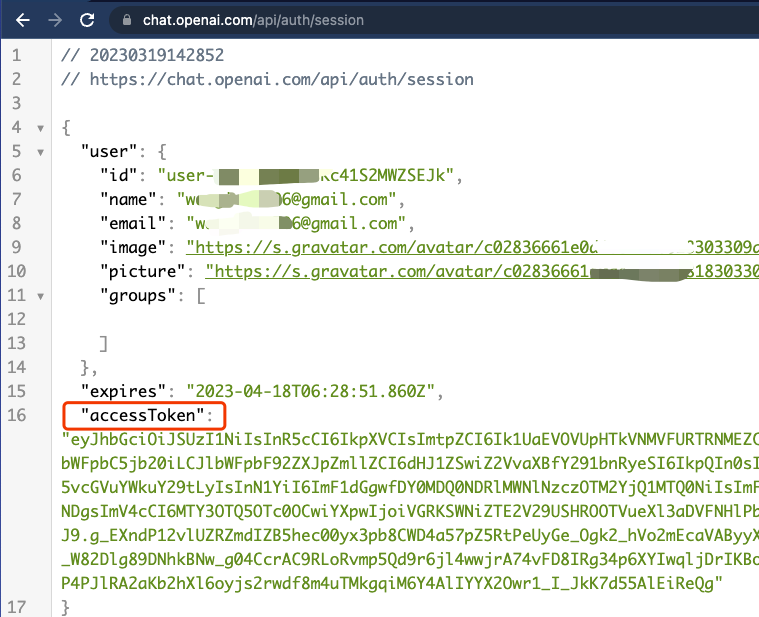

# ebpf

eBPF 是 Linux 内核在近几年最大的突破性创新技术，在网络数据处理、内核态和用户态函数调试、性能监控等领域发挥了重要作用。但作为一个新技术，eBPF 的学习成本较高，即使是方便普通用户上手的 bpftrace 命令，在有着和 awk 命令相似的外观同时，也依然有各种新数据结构、新语法和新限制要学习。

[GPTtrace](https://github.com/eunomia-bpf/GPTtrace)项目，就利用了 ChatGPT 的能力，来辅助用户上手 bpftrace 工具的使用。

GPTtrace是一种基于eBPF技术的智能编程工具，旨在为用户提供一种以自然语言输入请求的方式生成eBPF程序的解决方案。其工作原理大致分为以下几步：：

首先，GPTtrace使用各种eBPF开发资源预训练其eBPF程序，以便能够更好地与ChatGPT进行多次对话，让ChatGPT学习如何编写不同类型的eBPF程序和bpftrace DSL。这为用户提供了一个更加智能和高效的eBPF编程环境。

其次，用户以自然语言输入请求，GPTtrace便会调用ChatGPT API生成eBPF程序。生成的程序可以通过shell执行或写入文件进行编译和执行，从而实现用户输入请求的功能。

最后，如果在编译或加载过程中出现错误，GPTtrace会将错误信息发送回ChatGPT，以生成新的eBPF程序或命令，从而提高程序的准确性和鲁棒性。

和其他基于 GPT3 接口的项目不同，该项目完整利用了 ChatGPT 的交互形式，因此， GPTtrace 的训练过程，其实就是 prompt 对话内容，详见 `train/` 目录中的若干文档。因此，即使完全不懂编程的人(这可能是句废话，都用上 `bpftrace` 这种高级调试技巧的人怎么可能不懂编程)，也可以直接从 train 目录里复制出来对话语句，贴进 ChatGPT 界面上，复原整个过程。

我们如果想使用GPTtrace，那要先做一些准备工作，首先就是将 GPTtrace 的代码clone到本地。然后从ChatGPT获取 Conversion ID，将其设置为环境变量 GPTTRACE_CONV_UUID 或使用-u选项。 Conversion ID 是对话URL的最后一部分，例如，https://chat.openai.com/conv/xxxxxxxx-xxxx-xxxx-xxxx-xxxxxxxxxxxx 的 Conversion ID 是 xxxxxxxx-xxxx-xxxx-xxxx-xxxxxxxxxxxx 。


从ChatGPT获取访问令牌，然后将其设置为环境变量 GPTTRACE_ACCESS_TOKEN 或使用-t选项。我们可以访问 https://chat.openai.com/api/auth/session 获取访问令牌。



接下来，我们使用 promp 教ChatGpt写eBPF程序。这将使用prompts目录中的材料教 ChatGPT 使用bpftrace、libbpf和BCC风格下编写eBPF程序。使用``` pip install -r requirement.txt ``` 安装好依赖以后，我们运行 ```./GPTtrace.py --train```


