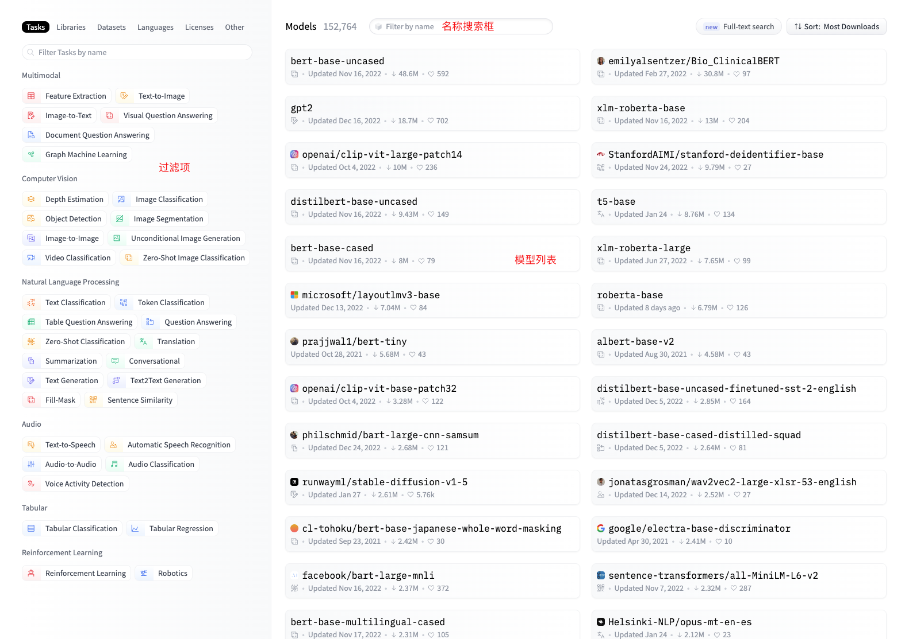

# Hugging Face

Hugging Face 是一家在自然语言处理和人工智能领域著名的公司，以开发开源的软件库和工具为主要贡献，其中最受欢迎的是 Transformers 库，广泛应用于诸如语言翻译、情感分析和问答等多种自然语言处理任务。此外，Hugging Face 还开发了一些商业产品，例如 Hugging Face Spaces 和 Hugging Face Datasets，为构建和部署自然语言处理模型提供工具和基础设施。

Hugging Face Hub是一个社区，旨在为机器学习开发者提供各种功能。其中主要包括：

* 模型仓库（Model Repository）：类似于Git仓库，允许用户管理代码版本和开源代码，模型仓库则让用户管理模型版本和开源模型等。使用方式与Github类似。

* 模型（Models）：Hugging Face为不同的机器学习任务提供了许多预训练好的机器学习模型，这些模型存储在模型仓库中。

* 数据集（Dataset）：Hugging Face上有许多公开数据集可供用户使用。

在NLP领域，Hugging Face因其提供基于Transformer的模型而闻名。为了方便用户使用，Hugging Face还提供了以下几个项目：

* Transformers ：Transformers 库是Hugging Face的核心，我们学习Hugging Face其实就是学习怎么使用这个库。这个库提供了API和很多工具及方法，方便我们下载和训练最先进的预训练模型。这些模型支持不同模态下的常见任务，例如自然语言处理，计算机视觉，音频，多模态等。

* Datasets ：使用该框架，只需要少量代码即可轻松下载和预处理常见公开数据集。同时还提供了强大的数据预处理方法，可帮助我们快速准备数据，以用于训练机器学习模型。

* Space ：在这里我们可以在线体验很多有趣的应用，比如根据文字生成图片，根据我们的照片制作合成音视频等。

那究竟如何使用 Transformers进行推理呢？首先我们先要安装Transformers：

```
pip install transformers
```

如果任务比较简单，Transformers的pipline()函数本身就提供了很丰富的功能，比如下面的代码，就多一个语句进行了一个简单的情感分析：

```
from transformers import pipeline
​
classifier = pipeline("text-classification")
classifier("This book is awesome.")
```
运行上面的代码，会先下载默认的模型，在加载模型的时候，可能会因为缺少库而报错，我们只需要安装对应的库即可，模型下载好以后就会对我们输入的句子进行情感分析，结果如下：

```
[{'label': 'POSITIVE', 'score': 0.9998772144317627}]
```

这个结果表明这是一个正向的句子，概率为0.999877。

如果我们希望执行的任务官方并没有对应的默认模型提供，我们可以去官网上按照下面的流程自己寻找合适的模型，然后在代码中明确使用某个模型即可。

首先我们打开 Hugging Face 官网，点击导航栏中的 Models 进入模型页面：



页面主要分为三个部分，左侧是过滤项列表，分不同的维度列出了许多过滤项，点击即可进行过滤；右侧顶部是搜索框，可以根据名字搜索模型；下方是模型列表，不带前缀的是官方模型，例如 gpt2，带前缀的是第三方提供的模型，例如 microsoft/layoutlmv3-base。

我们通过过滤或者搜索找到我们所需模型后，点击进入模型详情页面，如下图：


页面最上方是模型名字，往下一点便是模型的标签，主体部分，靠左的是模型的详细说明，右侧是一些关联信息，如果模型的API托管在 Hugging Face上，就会出现框柱的部分，我们可以在这里进行模型效果的体验。假设我们想试试 distilgpt2 模型生成文本的效果如何，我们可以使用如下代码：

```
from transformers import pipeline

generator = pipeline("text-generation", model="gpt2")
generator( "The book is awsome and", max_length=30, num_return_sequences=2)
```

稍等片刻即可获得运行结果，是两句根据我提供句子的开头自动生成的完整话语。

```
[{'generated_text': 'The book is awsome and beautiful, I love it. I love how this story follows everyone from the protagonist of this book with her family to his'}, {'generated_text': "The book is awsome and fascinating. I'm sure you're already familiar with the way things turn out after reading one of its pages of novels."}]
```

这只是 Hugging Face 的简单用法，他还有很多很厉害的功能，我们可以通过网站的 Spaces 菜单进入 Space 页面进行体验，也可以按照官方文档进行更深入的研究。

除此之外，国内也开始建设类似的 MaaS 网站，比如：<https://modelscope.cn/>。

