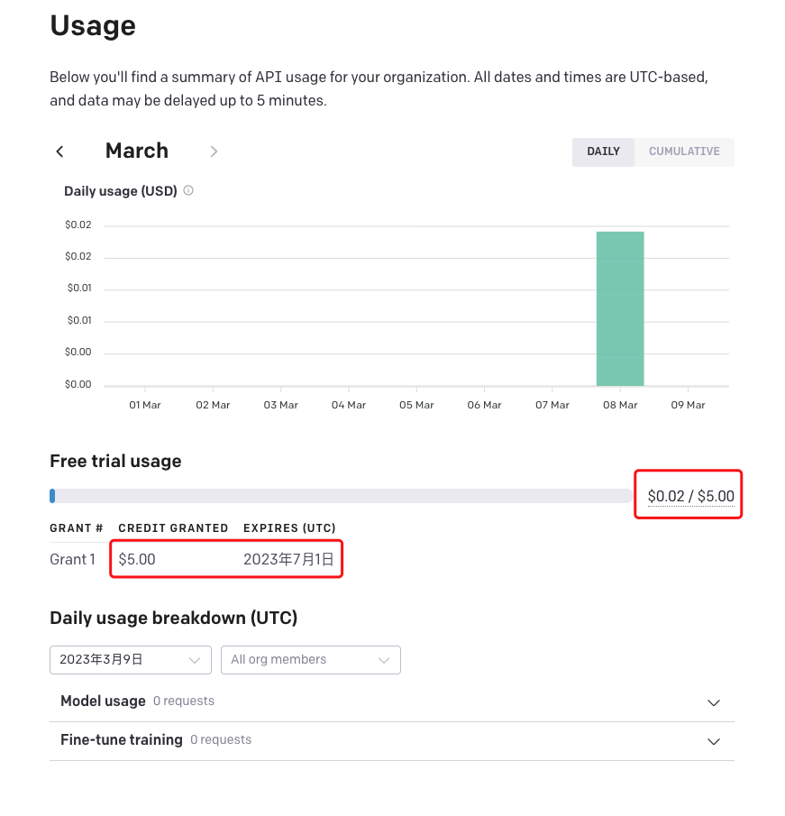
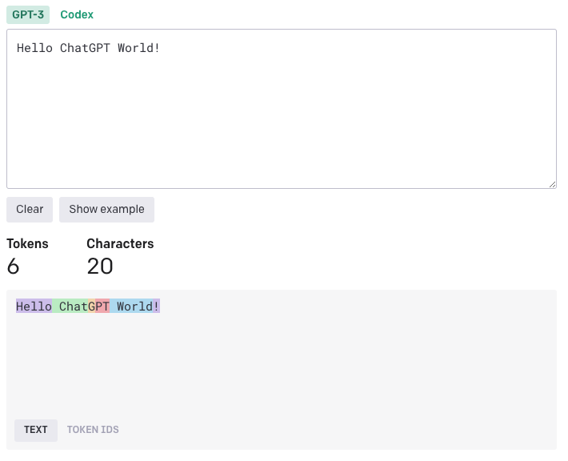
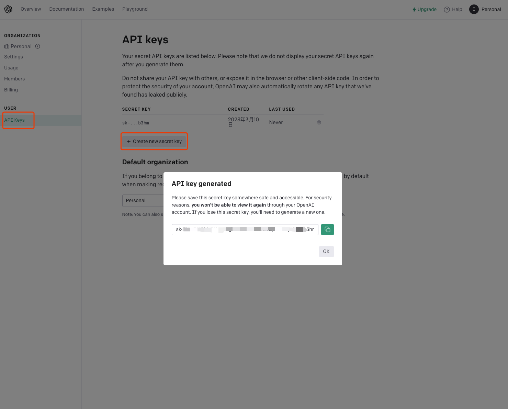
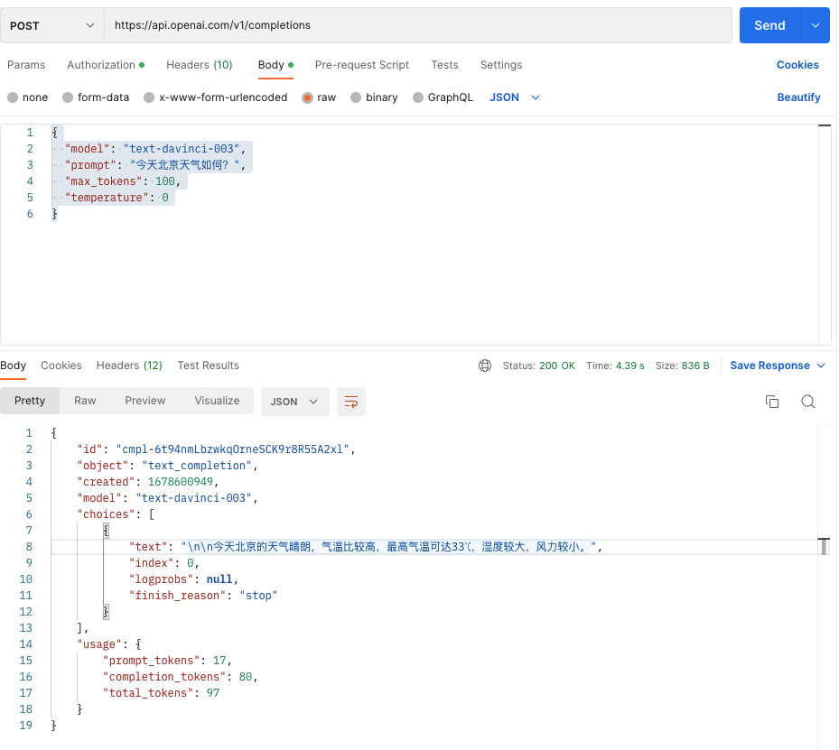
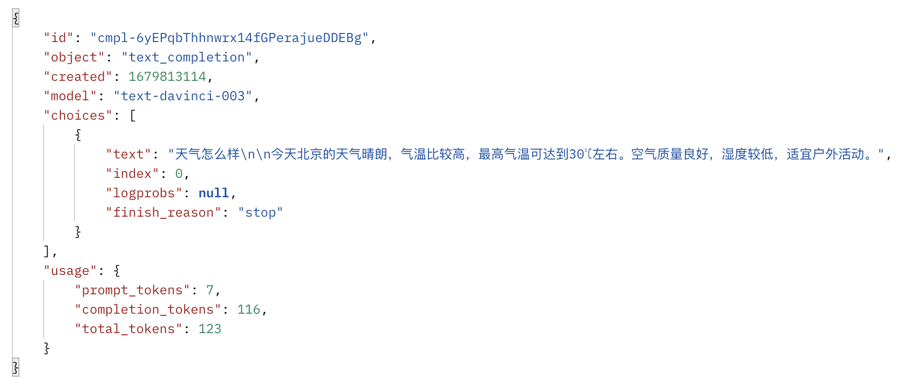
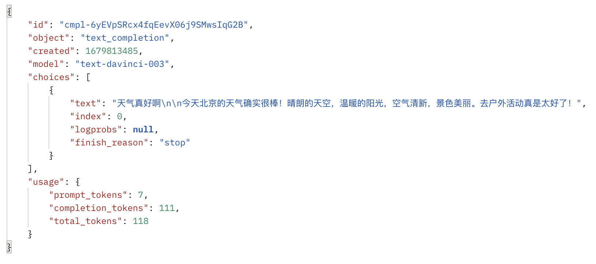
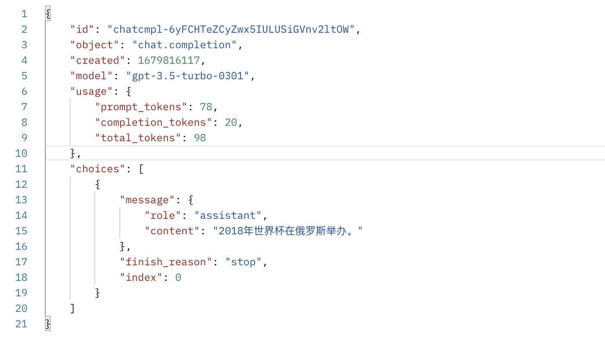

# 开通 API 使用

## OpenAI API 费用

OpenAI API 是商业服务，使用 API 需要支付费用，不过当我们创建OpenAI账户后，会有5美元的免费试用额度（最开始的新用户有18美元的额度，后面降下来了），不过要注意一下，免费额度有时间限制，过期就作废了。我们可以打开`https://platform.openai.com/account/usage`网址查看自己的额度信息。



既然API的使用需要付费，我们就需要了解一下它的计费方式。根据官方文档，OpenAI的API是以每1000个token作为一个计费单元，使用不同的模型，每计费单元的单价也不尽相同，就拿2023年3月2号新开放的ChatGPT所使用的gpt-3.5-turbo模型来说，他的价格为`0.002美元/1K tokens`，也比之前便宜了很多。虽然1000个token看起来很多，但实际上通过API发送一段文本就会花去很多token。所以，到底什么是token呢？Token是OpenAI对文本进行自然语言处理进行分词后切分成的最小字符序列。举个例子：`Hello ChatGPT World!`这句话，会被切分成 `Hello`、`Chat`、`G`、`PT`、` World`、`！`这六个token。



如果是中文呢？我们猜猜`你好，科技的未来！`会花费多少个token呢？答案是21个！


通常来讲，英语中的一个 token 大概对应约4字符，这相当于大约3/4个单词，因此整体上来说 100个token大约为75个英文单词。而1个汉字大致就要花费是2~2.5个token。如果我们想查询一串文本到底需要小号多少token，可以使用官方的免费查询计算器 https://platform.openai.com/tokenizer 计算一下，心里就有底了。


## 生成API KEY

想使用OpenAI的API，光有余额是不行的，还要生成一个API KEY。我们在OpenAI的概览页面点击左侧导航的 API Keys —> 再点击Create new secret key，就可以生成一个新的API，这里要注意，*这个API只在生成的时候展示一次*，请务必在关闭对话框之前，将其复制到你其他的地方保管。有了这个API，就可以再任何需要调用ChatGPT API的场景中使用了。

还需要注意的是，出于安全原因，我们不要把这个API Key分享给其他人使用，也不要在浏览器或其他客户端代码中公开它。为了保护账户的安全，OpenAI也可能会自动更改任何已经公开泄露的API密钥。



我们可以简单使用postman试一下通过API KEY调用API是否好用。我们在地址栏中输入 https://api.open.com/v1/completions 然后选择POST，在Authorization中选择Bearer Token同时把Token 设置为刚才获取的 API KEY ，设置header中的 Content-Type 为 application/json，发送的body写成如下形式，表示在100个token的限制内，通过api接口获取北京天气状况。
```
{
  "model": "text-davinci-003",
  "prompt": "今天北京天气如何？",
  "max_tokens": 100,
  "temperature": 0
}
```
发过去稍等片刻后，返回的数据如下：



我们发现返回的数据中用了100个以内的token描述了北京今日的天气状况。
好了，这就是Open API的基本使用方式了。

# 常用API接口和参数说明

### Completions

从名字我们大概就能推断出来这个接口的作用，completions主要解决文字补全问题。具体来说，就是当我们输入一段文字发送给接口后，我们选用的模型会按照文字的提示，给出对应的输出，可以理解为诱导型的对话。

#### 接口地址

```
POST
 
https://api.openai.com/v1/completions

```

#### 常用参数

completions接口提供了大概16个参数来控制模型处理的方式以及返回的结果。其中常用的有如下几个：

* model：这个参数很重要，是一个必选参数，我们要将接口需要用到的具体模型名称填写在这里。
* prompt：可以传字符串或者是数组。我们可以理解为给模型的提示词，具体来说就是引导模型进行结果生成，prompt写的越具体，模型给出的结果也就越可能准确。我们还可以在prompt中加入待处理问题的样例，这有助于模型更好地理解问题的上下文和要求，并提高模型的准确性。同时，对于较为复杂的问题，我们可以设计更具引导性的prompt，帮助模型将一个问题分解成多个小问题，并根据问题的关键点和上下文，生成一系列推理链，以逐步深入理解问题的含义和解决方案。
* max_tokens：生成结果的最大token数，我们的prompt加上max_tokens不能超过模型的token数上线，比如对于 ```text-davinci-003``` 模型，上限是4096个token。
* temperature：这个参数用来控制生成的文本输出的随机程度。 temperature 值越高，输出的结果越随机，更有创意，而值越低则输出的结果则越趋向于确定性，呈现出的结果也会更加保守也更可预测。
* top_p：简单来说就是模型在最可能出现的那些token中，选用概率累计超过多少的token作为采样范围。

#### 举个例子

假设我们的参数这样设置：
```
{
  "model": "text-davinci-003",
  "prompt": "今天北京",
  "max_tokens": 1000,
  "temperature": 0.3,
  "top_p": 0.3
}

```
接口的返回如下：



如果我们把 temperature 参数调大，把 top_p 也调大，这样模型就可以在更多的预测token中发挥创造力。
```
{
  "model": "text-davinci-003",
  "prompt": "今天北京",
  "max_tokens": 1000,
  "temperature": 0.9,
  "top_p": 0.9
}
```


我们看这回的结果就要活泼很多，同时也联想到了是个户外运动的好天气。

### Chat

Chat接口用来处理聊天任务。与 Completion 接口相比，Chat接口可以实现多轮对话，不过这需要我们自行维护上下文，而且当token的数量超过model可处理的最大值时，我们要对上下文进行总结。

#### 接口地址

```
POST
 
https://api.openai.com/v1/chat/completions

```

#### 常用参数

Chat接口也属于一种completion，所以很多参数都是复用的，不过Chat接口提供了两个特殊的参数：``` messages ``` 和 ``` user ```

* messages：我们用这个参数描述对话上下文，需要按照 openAI要求的 Chat format 来组织数据格式。messages必须是一个消息对象数组，其中每个对象都有一个role（角色）-- “system”、“user”或“assistant” 以及 content（消息的内容）。对话可以短至 1 条消息或填满整个屏幕。通常来讲，模型首先使用系统消息进行格式化，然后是交替的用户和助理消息。
  
  例如：

  ```
  {
      "model": "gpt-3.5-turbo",
      "messages": [
          {"role": "system","content": "你是一个有用的助手"},
          {"role": "user", "content": "2018年世界杯冠军时那支队伍？"},
          {"role": "assistant","content": "2018年世界杯冠军是法国队。"},
          {"role": "user", "content": "在哪里举办？"}
      ]
  }
  ```
  接口返回的结果为：

  

  我们可以看到，在请求中通过messages字段提供了问题上下文后，接口可以非常准确的给出我们最后的那个非常模糊的 在哪里举办 的问题的正确答案。

* user：最终用户id，我们在请求中发送最终用户ID 可以帮助 OpenAI 监控和检测接口的使用情况，防止滥用接口的现象。如果检测到应用程序中存在任何违反政策的情况，OpenAI可以给我们提供更多可操作的反馈。

