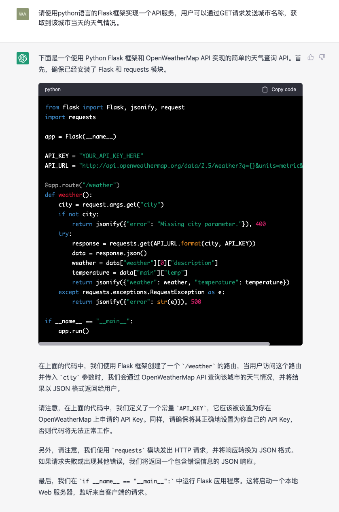
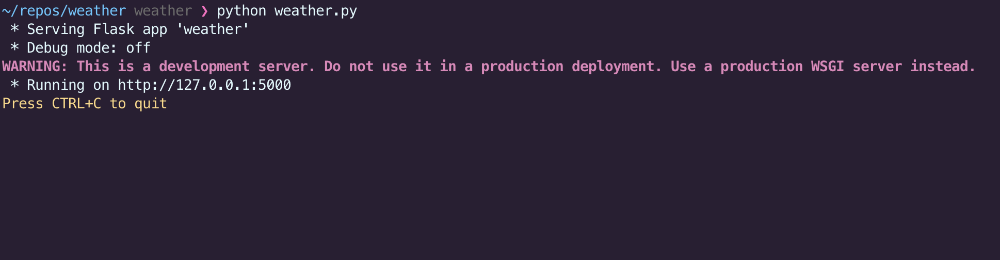
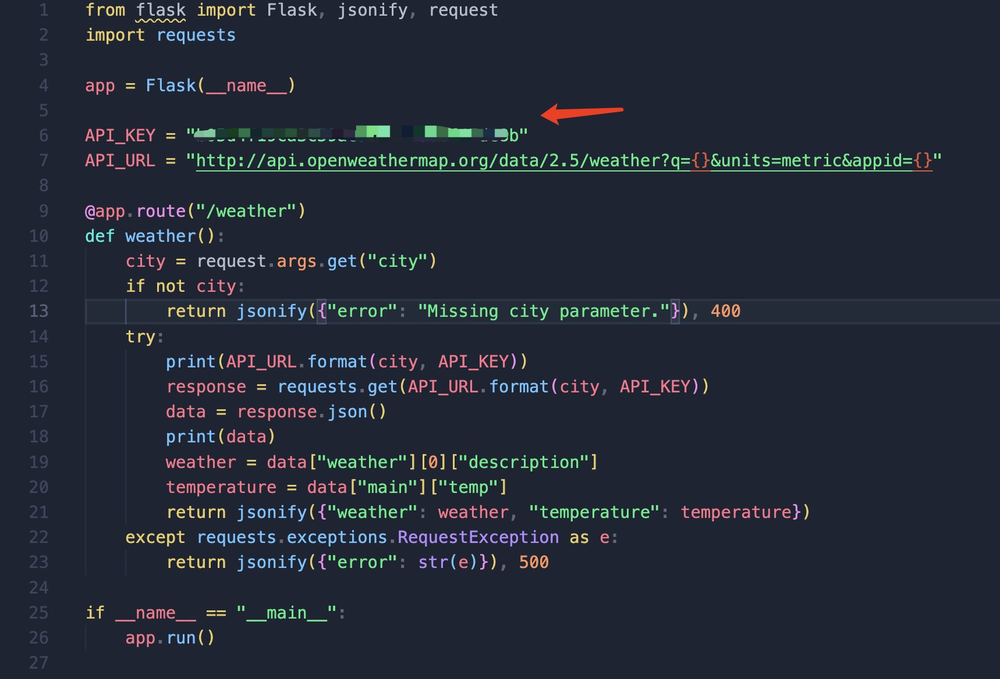
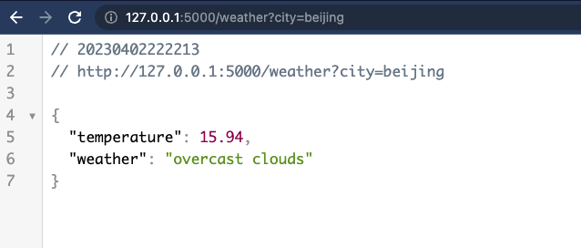

# 生成代码

就代码生成而言，ChatGPT 是一款卓越的工具，它为开发者提供强大的功能。ChatGPT 可以运用其出色的自然语言处理技术，深入理解和解释开发者的需求，快速生成适合的代码片段。对于那些繁琐的任务或者重复的代码，ChatGPT 能够在瞬间完成，让程序员将更多的时间投入到核心开发中。

接下来就让我们用一个小例子来体验一下ChatGPT在代码生成方面的强大功能。

比如说我们希望构建一个API服务，这个API服务提供一个接口，该接口可以根据URL中的城市名称参数返回该城市的天气情况。我们可以向ChatGPT提出这样的需求：

请使用python语言的Flask框架实现一个API服务，用户可以通过GET请求发送城市名称，获取到该城市当天的天气情况。



我们看到ChatGPT根据我们的需求，生成一个完整的代码片段，包括了API服务的基本框架，以及根据城市名称获取天气情况的代码逻辑，并对这段代码的执行逻辑进行了比较详细的解释。我们将这段代码保存为weather.py，然后在终端中尝试运行。当然，我们先按照要求安装一下`flask`和`requests`这两个依赖库。

```bash
pip install flask requests
```

然后运行代码：

```bash
python weather.py
```




程序正常运行了，但在使用前，我们需要先注册一个 openweathermap.org 账户并获取一个 API key。将 API key 填入代码中，然后再次运行程序。



当程序运行以后，我们可以在浏览器中访问`http://http://127.0.0.1:5000/weather?city=beijing`，查看北京的天气情况。



可以看到，我们刚才创建的服务正确的返回了北京的天气情况。这个API服务，我们只需要花费几分钟的时间就构建完成了，而且基本不需要写任何代码，这就是ChatGPT的强大之处。

