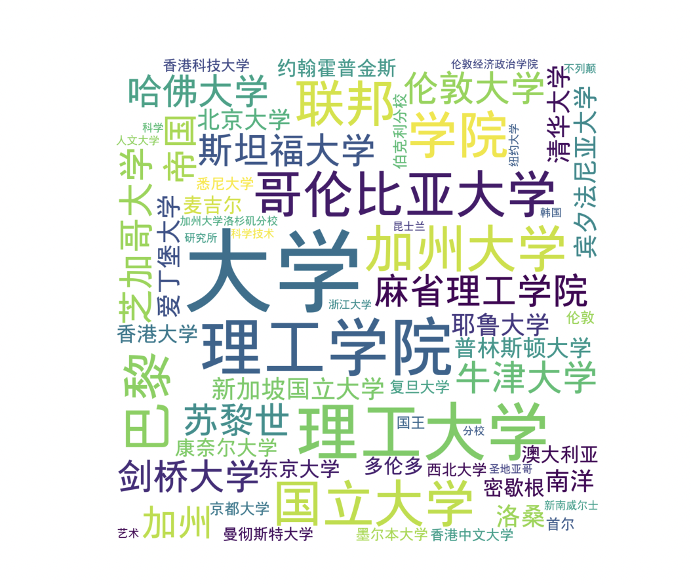
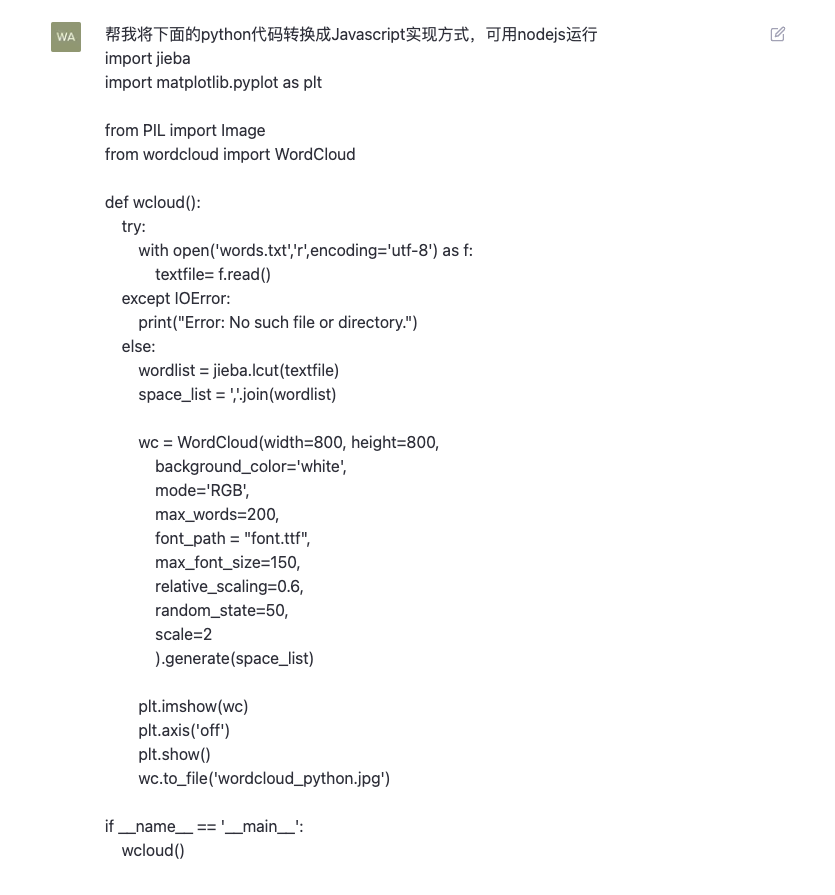
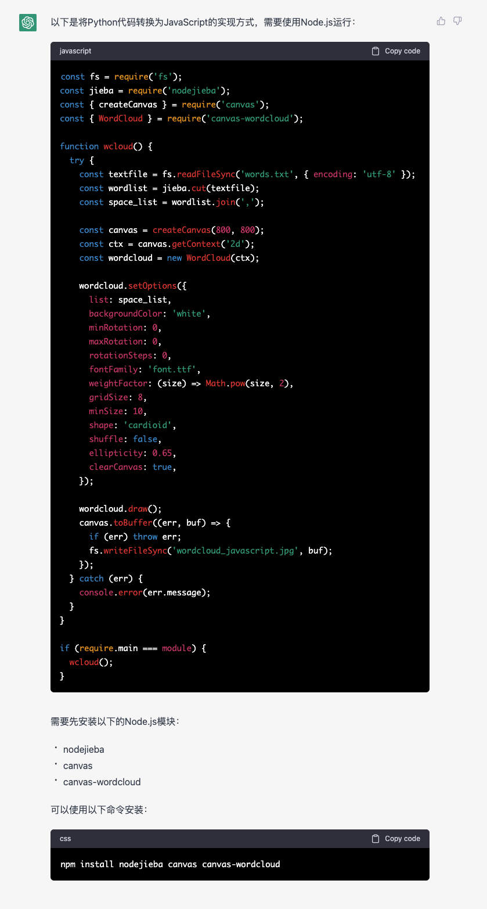
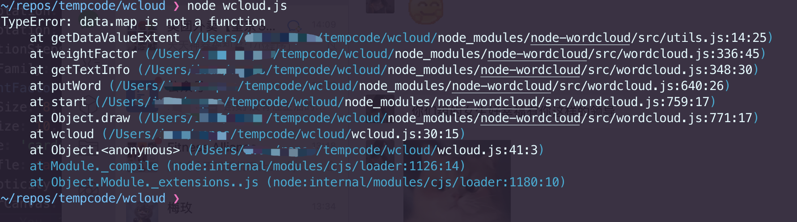
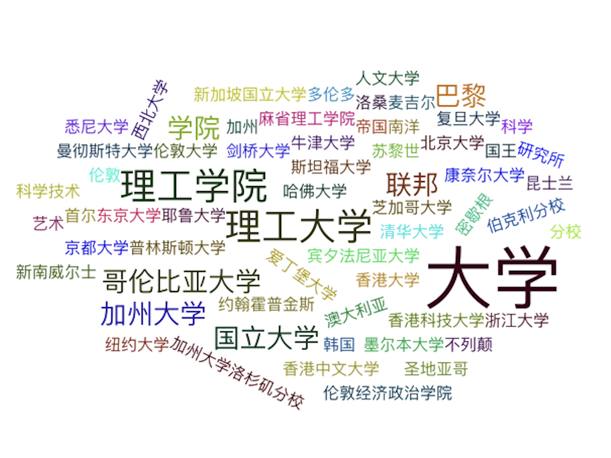

# 编程语言转换

对于程序员来说，往往有一类工作，是需要将一部分业务逻辑实现从服务端转移到客户端，或者从客户端转移到服务端。这类工作，通常需要将一种编程语言的代码转换成另一种编程语言的代码，这就需要承担这项工作的人员同时具有这项工作涉及到的两种编程语言的知识，而且非常耗时且容易出错。现在，有了ChatGPT，我们就可以利用它来帮助我们完成这项工作，因为ChatGPT具有高度自适应性，可以自动学习源语言和目标语言之间的语义和结构差异，因此它可以适应各种编程语言和转换任务，包括不同语法结构和关键字的语言之间的转换。下面我们就来看看ChatGPT是如何帮助我们完成这项工作的。

我们先来看一个简单的例子，比如说我们有一个服务端的代码片段，它的功能是从本地文本文件中读取词语，生成一个词云图：

```python
import jieba
import matplotlib.pyplot as plt

from PIL import Image
from wordcloud import WordCloud

def wcloud():
    try:
        with open('words.txt','r',encoding='utf-8') as f:
            textfile= f.read()
    except IOError:
        print("Error: No such file or directory.")
    else:
        wordlist = jieba.lcut(textfile)
        space_list = ','.join(wordlist)

        wc = WordCloud(width=800, height=800,
            background_color='white',
            mode='RGB',
            max_words=200,
            font_path = "font.ttf",
            max_font_size=150,
            relative_scaling=0.6,
            random_state=50,
            scale=2
            ).generate(space_list)

        plt.imshow(wc)
        plt.axis('off')
        plt.show()
        wc.to_file('wordcloud_python.jpg')

if __name__ == '__main__':
    wcloud()
```

运行结果如图所示：



现在因为业务需要，我们需要将这段代码转移到客户端，因此我们需要将这段代码转换成JavaScript代码，这样就可以在客户端运行了。我们看看ChatGPT如何来完成这项工作，我们将代码片段输入到ChatGPT对话框中，要求ChatGPT帮我们转换成Javascript的实现方式，如下图所示：



ChatGPT的回复如下：



我们看到，ChatGPT不仅仅将代码转换过来，并且对于使用的第三方库，也找到了Javascript中可用的相对应的依赖库，而且调用第三方库的一些参数，也保留下来并在Javascript中正确设置了对应的参数，我们将ChatGPT的回复复制到本地，保存为js文件，然后使用`npm`安装好ChatGPT提示的需要安装的node的依赖库。

不过这里有两个地方，ChatGPT生成的并不准确，其一，并不存在`canvas-wordcloud`这个依赖库，我们需要使用`node-wordcloud`来替换，同时修改代码中的引用方式为`const WordCloud = require('node-wordcloud')();`，并将使用WordCloud的地方修改为如下代码:
```javascript
...
    const canvas = createCanvas(800, 800);
    // const ctx = canvas.getContext('2d');
    const wordcloud = WordCloud(canvas, {
      list: space_list,
      backgroundColor: 'white',
      minRotation: 0,
      maxRotation: 0,
      rotationSteps: 0,
      fontFamily: 'font.ttf',
      weightFactor: (size) => Math.pow(size, 2),
      gridSize: 8,
      minSize: 10,
      shape: 'cardioid',
      shuffle: false,
      ellipticity: 0.65,
      clearCanvas: true,
    });
...
```

其二，如果是mac系统的话，需要先使用`brew install pkg-config cairo pango libpng jpeg giflib librsvg` 安装依赖，然后在使用命令安装 `npm install canvas`，否则会报错。

最后我们运行这段代码，结果居然报错了：



经过分析，发现是因为传给wordcloud的数据格式不正确，于是我们要求ChatGPT按照包含关键词和权重的二元组数组的格式重新组织数据，生成的代码中数据处理部分如下：

```javascript
...
    const textfile = fs.readFileSync('words.txt', { encoding: 'utf-8' });
    const wordlist = jieba.cut(textfile);
    const keywords = [...new Set(wordlist)];
    const space_list = keywords.map((word) => [word, wordlist.filter((w) => w === word).length]);

    const canvas = createCanvas(800, 800);
...
```

接下来我们运行代码，词云图片成功生成了：



但是通过对比两个词云的图片，我们发现两个词云的样子有一些差别，这是由于 python 的 wordcloud 和 node 的 wordcloud 两个库的实现方式不同导致的，通过询问ChatGPT，但是它并没有给出正确的参数设置，因此我们手动对参数进行一些调整才能得到期望的样式。

