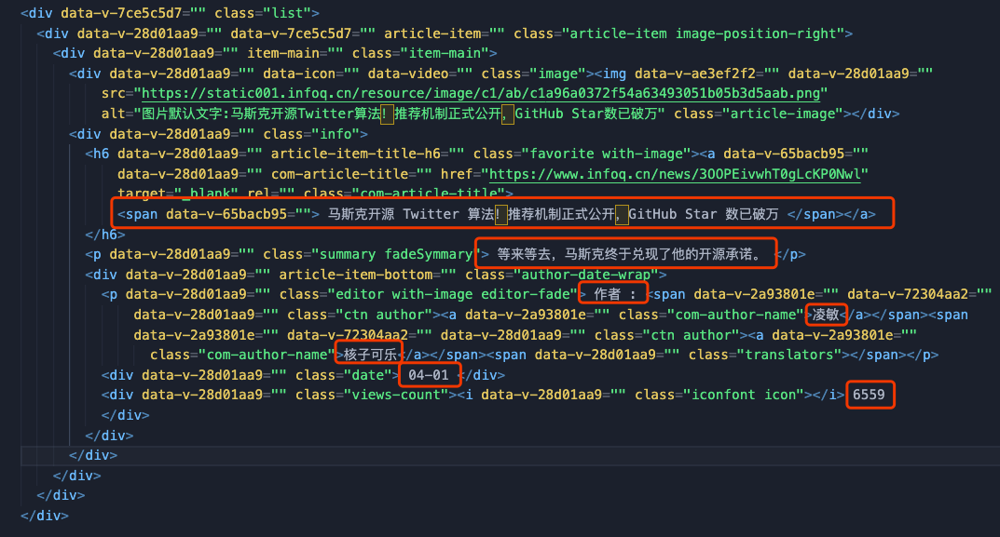
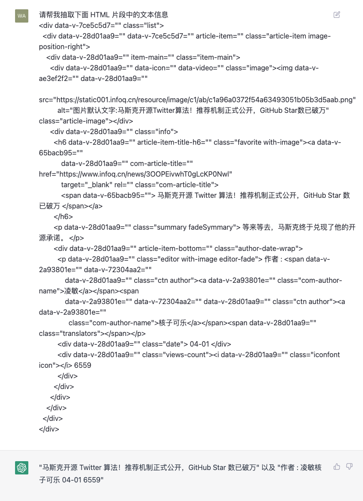
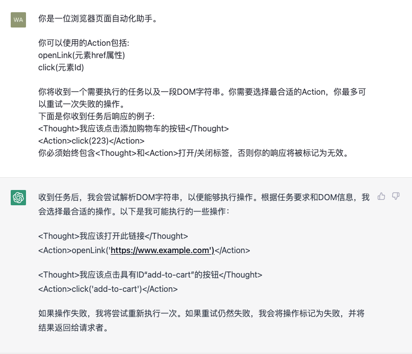

# 网页自动化工具

既然ChatGPT对于编程语言有非常强大的理解能力，那么它是否可以用来自动化地处理网页呢？答案是肯定的。ChatGPT可以使用机器学习算法来识别网页元素中的文本，并抽取出有用的信息。

例如我们提供一段层数比较多的相对来说较为复杂的 HTML 代码，如下图所示：



图中我们用红框标出的部分是需要抽取的文本，我们可以要求 ChatGPT 帮我们抽取出其中的文本，看看是否如我们期望的，只将红框中的部分抽取出来。如下图所示：



我们看到，ChatGPT成功地将红框中的文本抽取出来了，而且没有将 HTML 片段中
```html

```
图片标签的默认显示文字抽取出来，可以说对于文本部分的识别成功率还是不错的，后续我们就可以基于这些抽取出来的文本进行进一步的处理了。

ChatGPT对于 HTML 的理解不仅仅在于文本的抽取，它可以识别整个 HTML 的结构，基于这个能力，我们就可以要求 ChatGPT 帮我们去实现一些更有趣的功能。比如我们希望通过输入文本指令，可以控制网页中的元素进行一些操作，例如点击、输入、滚动等等，那么我们可以通过 ChatGPT 对指令进行解析并根据预设的操作和要求，帮助我们按照模版生成相应的指令片段，这样我们后续就可以根据这些统一格式的指令片段进行解析并做相应的处理了。例如，我们可以先给ChatGPT设定一个prompt（提示），告诉他要做什么事情，按照什么模版进行输出：

    你是一位浏览器页面自动化助手。

    你可以使用的Action包括:
    openLink(元素href属性)
    click(元素Id)

    你将收到一个需要执行的任务以及一段DOM字符串。你需要选择最合适的Action，你最多可以重试一次失败的操作。
    下面是你收到任务后响应的例子:
    <Thought>我应该点击添加购物车的按钮</Thought>
    <Action>click(223)</Action>
    你必须始终包含<Thought>和<Action>打开/关闭标签，否则你的响应将被标记为无效。

ChatGPT收到这个prompt后，就会对这个提示进行上下文设定并将自己对于该提示的理解输出。我们可以看看ChatGPT的理解对不对，如下图所示：



可以看到，ChatGPT成功的理解了我们为他设定的prompt，接下来我们就要测试一下他能不能正确执行我们的指令了。我们在输入框中输入如下内容：

    用户发起了如下任务:
    请打开文章链接

    下面是页面内容：
    <div data-v-7ce5c5d7="" class="list">
    <div data-v-28d01aa9="" data-v-7ce5c5d7="" article-item="" class="article-item image-position-right">
        <div data-v-28d01aa9="" item-main="" class="item-main">
        <div data-v-28d01aa9="" data-icon="" data-video="" class="image">
```
这个link标签中的href属性，并将其作为参数传入了openLink()函数中，并且按照我们设定的输出模版，将<Thought>和<Action>正确的输出到页面上，这样我们就可以把这些统一格式的指令片段进行解析，然后按照需求做相应的处理了。

我们可以预见，这种利用ChatGPT实现的网页自动化技术，未来会有更多的应用和创新，可以使得基于网页的工具更加智能化，更加便捷，应用的场景也会越来越广泛。

