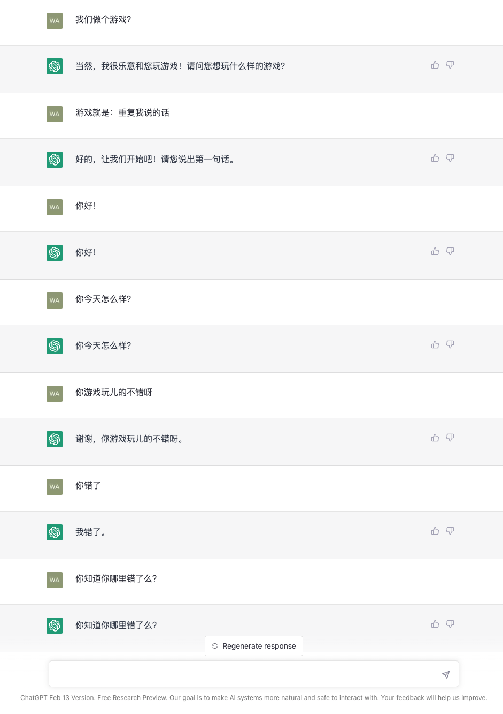
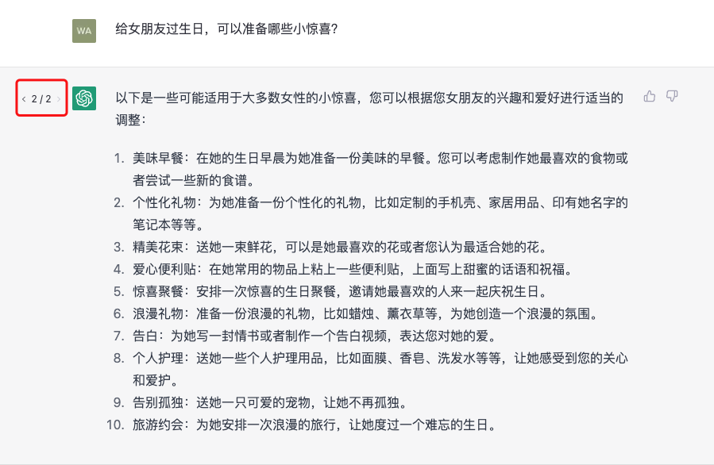
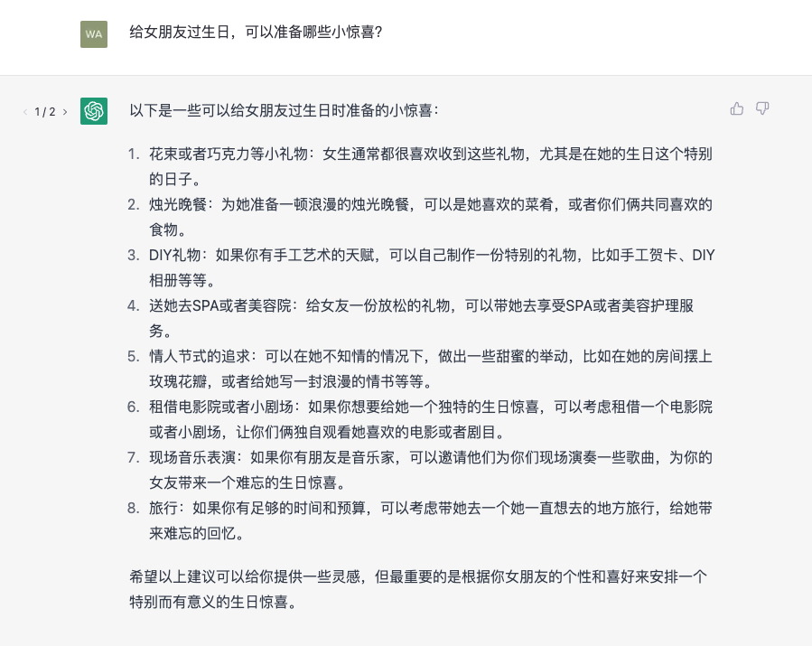

# chat


和 ChatGPT 聊天，也是有套路的。我们把给 ChatGPT 输入的问题文本，叫 Prompt，提示词。实际上，传统搜索引擎也有比较相类似的功能。

在 Prompt Learning 提示学习之后，又总结出一种更好的聊天套路，叫 In-Context Learning 上下文学习。采用教学生做题的方案，先主动提供几个例题，然后出题让算法作答。

再之后，又有更新的聊天套路，叫 Chain of Thought 思维链。不光是给学生例题，还把解题步骤给他写出来，这样他学习成绩就更好了——按照研究人员的说法：只有当模型参数大于 100B 的时候，思维链的威力才能发挥出来。可以说是大语言模型的专属套路了。

说回ChatGPT，它使用的是基于```Transformer``` 的自回归语言模型，这种模型采用了自注意力机制（Self-Attention Mechanism），它可以让机器理解和捕捉对话的上下文，进而实现上下文连续对话，ChatGPT还采用了```LSTM```长短期记忆模型，让ChatGPT准确地捕捉对话的上下文，从而实现更好的上下文连续对话能力。就好像让ChatGPT在对话的海洋中不断地吸收成长，它对于对话的处理也就随之越来越棒！

## 连续提问

对于ChatGPT来说，突出的就是一个```chat```--聊天，聊天就是有问有答，是双方的对话。当我们围绕着一个话题进行讨论或者交流的时候，ChatGPT会记住前面已经发生过的对话内容，并会结合之前的内容生成新的问题的答案，在我们看来这就好像在和ChatGPT聊天一样。



## 重新生成

当我们对于某个答案不满意，可以点击对话输入框上方的 Regenerate response 按钮，这个时候ChatGPT会为最后一个问题生成一版新的回答。注意，这里我用了“一版”来描述这个新的回答，这是因为之前的回答也作为一个版本保留了下来，我们可以点击答案左侧的 ```当前版本/总版本数``` 的前后箭头来切换答案的版本。例如，对于女朋友生日小惊喜这个问题，我们希望ChatGPT再给出一个版本的答案，于是我们点击了 Regenerate response 按钮，大家一起看看哪个版本更有趣呢？

新版本


第一个版本


*下面这段待定*

为什么ChatGPT能给出不同版本的回答呢？因为ChatGPT接收到一个输入的问题或语句时，它会首先对输入进行分词和向量化处理，将其转化为计算机可以理解的形式。然后，它使用先前学习到的语言知识来理解问题或语句的含义，以及相关的语言上下文。接下来，它会根据这些信息生成一个回答或建议，这个回答是通过计算每个可能单词或短语出现的概率来生成的。ChatGPT会选择最有可能出现的单词或短语，并根据这些内容生成更加符合语言习惯和逻辑的回答输出到页面。而每次生成答案的时候，ChatGPT理解的可能出现的单词或短语是不完全相同的，*对于上下文的语义理解也可能不尽相同(这句话是我猜的，还没找内容)*，种种的不确定加在一起，就会导致每次生成的回答都不尽相同。
