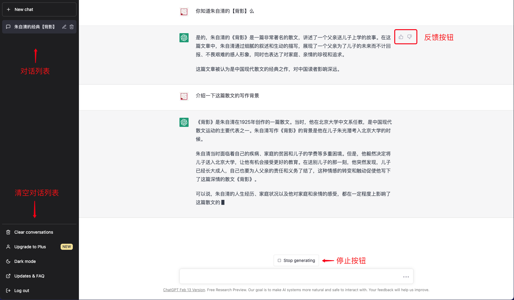

# 页面功能介绍

ChatGPT的页面是非常经典的左右布局，左侧是导航栏，右侧是页面的主要交互及展示区域

* 导航栏上半部分是对话列表区域
  * 最上方有一个发起新对话的按钮
* 导航栏靠下的部分是菜单部分，包括
  * 升级到高级用户
  * 白天黑夜模式切换
  * 升级以及FAQ
  * 退出
* 右侧页面是ChatGPT的主要交互区域
  * 在刚进入页面，并没有进行对话的时候，这里展示的是ChatGPT的能力介绍，包括
    * 示例：
    * 能力：
    * 限制：
  * 这块区域最下方，有一个类似百度等搜索引擎的搜索框，在这个输入框中写出你的问题，回车或者点击小飞机，就可以把输入内容发送给ChatGPT的后台，进行交流。

当你开始和ChatGPT进行对话以后，页面就变成下面的样子

页面上主要有以下几个变化
* 导航栏新建按钮下方会列出来之前与ChatGPT进行过的对话，以及正在进行的对话。
  
  而且你会发现，ChatGPT对每个对话都总结了一个标题，虽然有的时候总结的有些偏差，但是这也恰恰体现了ChatGPT的语言能力。
  
  当你选中某个对话的时候，标题后面会出现两个操作按钮，点击铅笔图标是修改标题，点击垃圾箱图标可以删除这个对话记录。

* 导航栏菜单区域多出一个清空对话列表的菜单项。
* 在ChatGPT生成答案的时候，主页面的输入框上方会出现一个停止生成的按钮，可以用于终止答案的生成。
* 刚才用于展示能力介绍的区域，就变成了一问一答的对话区域了。
  而且ChatGPT的每个回答的后面都有一对按钮，这对按钮是用来像后台算法反馈这次生成的内容是否符合你的预期，大拇指向上👍🏻的表示生成的赞，大拇指向下表示踩。
  无论你点击赞还是踩，都会弹出一个对话框，让你进一步说明。
  
  上图就是点了踩以后弹出的对话框。

以上就是页面在默认情况下，以及对话进行中的大体结构及功能介绍，后面章节笔者将对这些功能进行详细的讲解。