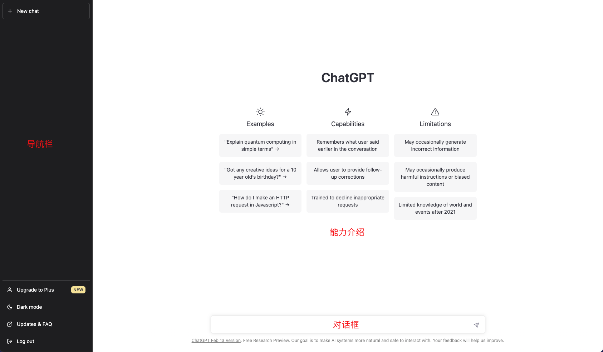

# 页面功能介绍

ChatGPT的页面是非常经典的左右布局，左侧是导航栏，右侧是页面的主要交互及展示区域

页面的组册时导航栏，导航栏上半部分是对话列表区域，最上方有一个发起新对话的按钮。导航栏靠下的部分是菜单部分，包括了`升级到高级用户`,`白天黑夜模式切换`，`升级`，`FAQ` 以及`登出`.
  
右侧页面是ChatGPT的主要交互区域，在我们刚进入页面并未发起对话的时候，这里展示的是ChatGPT的能力介绍，包括`示例`、`能力`和`限制`。在这块区域的最下方，有一个类似百度等搜索引擎的搜索框，在这个输入框中写出我们的问题，回车或者点击小飞机，就可以把输入内容发送给服务端，和ChatGPT进行交流啦。

当我们开始和ChatGPT进行对话以后，页面就会变成下面的样子：

这个时候页面会有几处变化，首先是左侧导航栏新建按钮的下方会列出来之前与ChatGPT进行过的对话，以及正在进行的对话。而且我们会发现，ChatGPT对每个对话都总结了一个标题，虽然有的时候总结的有些偏差，但是这也恰恰体现了ChatGPT的语言能力。
  
当我们选中某个对话的时候，标题后面会出现两个操作按钮，点击铅笔图标是修改标题，点击垃圾箱图标则可以删除这个对话记录。

导航栏菜单区域也多出一个清空对话列表的菜单项。

在ChatGPT生成答案的时候，主页面的输入框上方会出现一个停止生成的按钮，当我们觉得当前生成的内容并不是我们期望的答案，或者已经生成的答案已经足够回答我们提出的问题时，可以点击这个按钮终止答案的生成。

页面主体部分刚才用于展示能力介绍的区域，这个时候也变成了一问一答的对话区域。而且ChatGPT的每个回答的后面都有一对按钮，这对按钮用于对这次生成的内容是否符合你的预期进行反馈的。大拇指向上的表示赞，大拇指向下表示踩。无论我们点击赞还是踩，都会弹出一个对话框，让我们对于刚才的反馈做进一步更详细的说明。
  
  上图就是点了踩以后弹出的对话框。
