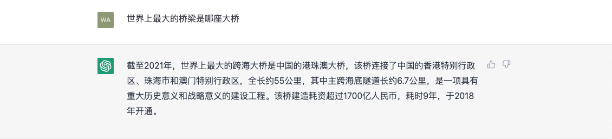
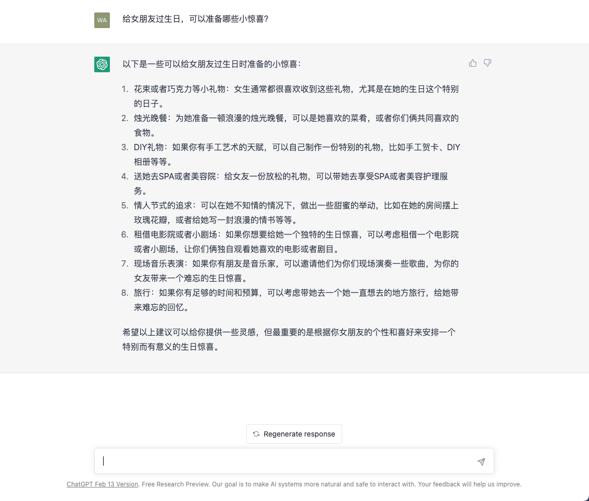
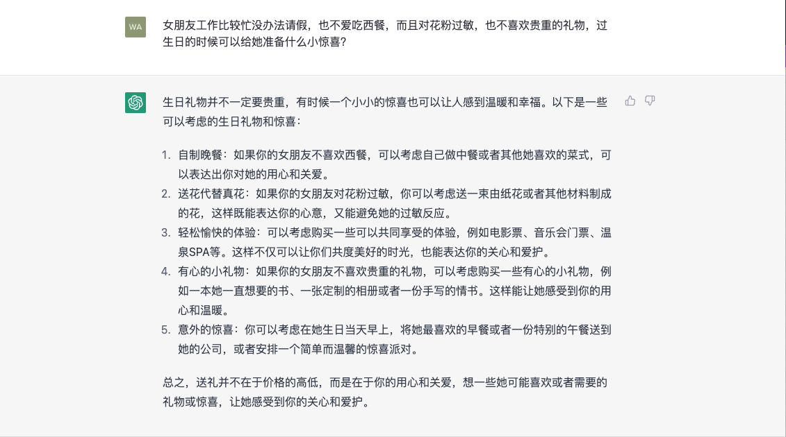
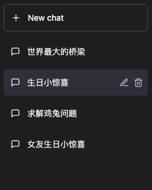

# 开始提问

当我们完成注册后，页面自动会跳转到ChatGPT的主页面，在这里我们就可以开始进行对话了。

我们在页面下方的输入框中填写问题，然后回车或者点击小飞机，我们的问题和ChatGPT的答案就会在页面上方以一问一答的格式展现出来。

我们可以把ChatGPT当做百科，问一问想知道的知识，例如：世界上最大的桥梁是哪座大桥？

    

我们也可以让它成为私人顾问，为活动出谋划策，例如：给女朋友过生日，可以准备哪些小惊喜？

    

或者我们就把它当做顺手的工具，计算复杂的问题，例如：有若干只鸡兔同在一个笼子里，从上面数，有35个头，从下面数，有94只脚。 问笼中各有多少只鸡和兔？

    

当然，这些都是些比较简单的用法，因为这些答案不会比使用百度或者百科等好多少。但是如果让问题更具体，例如：女朋友工作比较忙没办法请假，也不爱吃西餐，而且对花粉过敏，也不喜欢贵重的礼物，过生日的时候可以给她准备什么小惊喜？让我们看下ChatGPT能有哪些惊艳的表现。



既然是聊天，我们当然可以把问题都写在一个对话中，不过这却忽视了ChatGPT的一个重要的特性，就是他能够结合上下文进行对话，如果我们的上下文没有什么太大关系，可能会影响到ChatGPT模型对于当前问题的判断，从而导致答案不那么准确。所以，为了保持上下文语境的统一，我们最好在开启一个新的话题的时候，点击左上角的```New chat```创建新的对话，然后可以通过左侧的对话列表来查看之前的对话。


