# 注册ChatGPT账户

想要体验ChatGPT的令人赞叹的功能，首先要有一个ChatGPT账户，像注册一个属于你自己的ChatGPT账户并不复杂，但是需要先准备好如下工具：

* 一个梯子：众所周知，因为相关政策原因，你需要一个稳定的梯子，才能畅快的访问ChatGPT
* 一个特定国家的手机号：因为注册时需要接收短信验证码，而且只能给特定国家的手机号发送验证码，所以一个有用的手机号就十分重要。不过没有也没关系，可以找一些平台，也就是俗称的接码平台，花费少量的银子购买一个符合要求的虚拟手机号，然后用来接收短信验证码。
* 一个邮箱：注册ChatGPT账户需要用邮箱注册，常用邮箱一般都可以，不过最好还是使用谷歌或者outlook邮箱。

好了，当你准备好上述工具后，就万事俱备只欠东风了。接下来随作者一起，注册一个ChatGPT账号。
   
1. 打开梯子，使用谷歌或者Edge浏览器打开ChatGPT的地址 ```https://chat.openai.com/chat``` ，并点击"Sign up(注册)"按钮。
   
   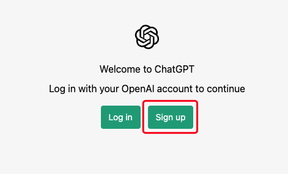

2. 进入到创建账户页面，在邮箱输入框中输入你准备好的邮箱地址，点击"Continue(继续)"，会出现密码输入框。

   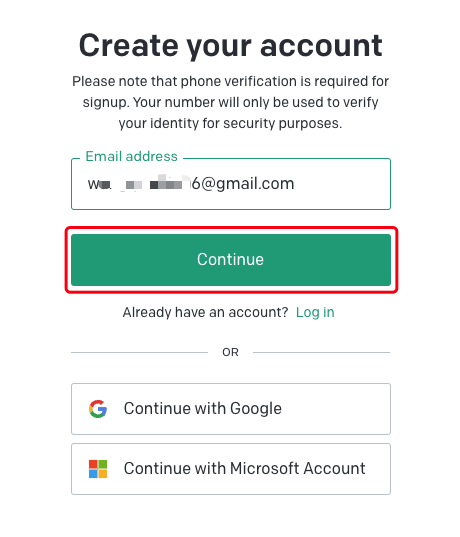
   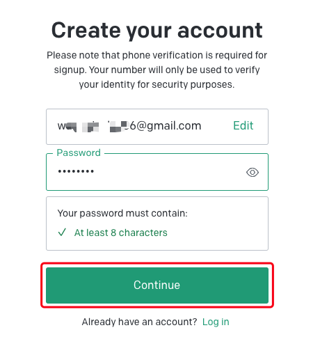

   密码强度只要求至少8位即可，输入好符合强度验证的密码后，点击"Continue(继续)"

3. 注册流程会提示你去验证邮箱。这个时候就需要你去刚才用于登录的邮箱系统中打开OpenAI发送的、主题是【OpenAI - Verify your email】的邮件，点击里面的验证邮箱按钮，进行邮箱验证，登录流程会引导你继续刚才的注册。
   
   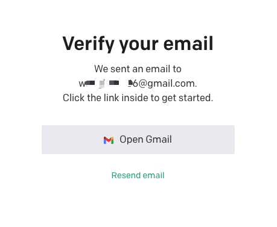
   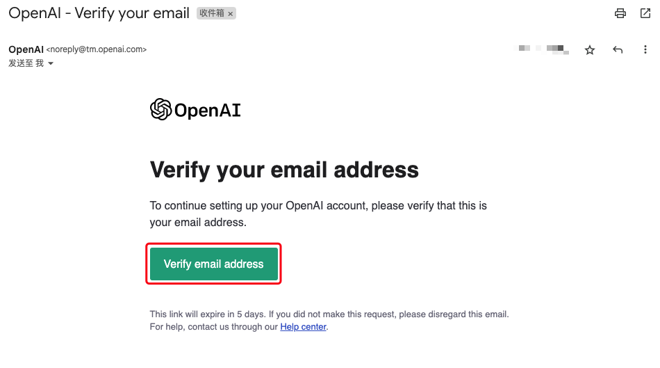

4. 注册流程继续，你点击上一步邮件中的按钮后就已经完成了邮箱认证，浏览器会打开输入姓名的页面。输入了自己喜欢的姓(Last name)和名(First name)后，点击确定按钮。这里要注意，点击确定就意味着你同意了ChatGPT的条款，并确认自己年满18周岁了。
   
   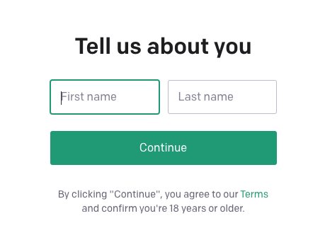

   填写完姓名点击继续后，接着就是进行短信验证，接码平台就要发挥作用了。

   

5. 接码平台有许多，你只要找一个熟悉的就可以，这里作者以```https://sms-activate.org/```举例，因为这个俄罗斯的接码平台有中文界面，并且可以使用支付宝，注册加接码整体花费大概在12元左右。
   
6. 在浏览器中打开上面接码平台的网址，点击右上角的登录注册，在弹出的窗口中点击注册，切换到注册窗口，输入邮箱和密码以及确认密码后，点击注册，这个时候可能会进行是否是机器人的验证，通过验证后，系统会提示注册邮件已经发送，我们去刚才输入的邮箱中查看邮件。
   
   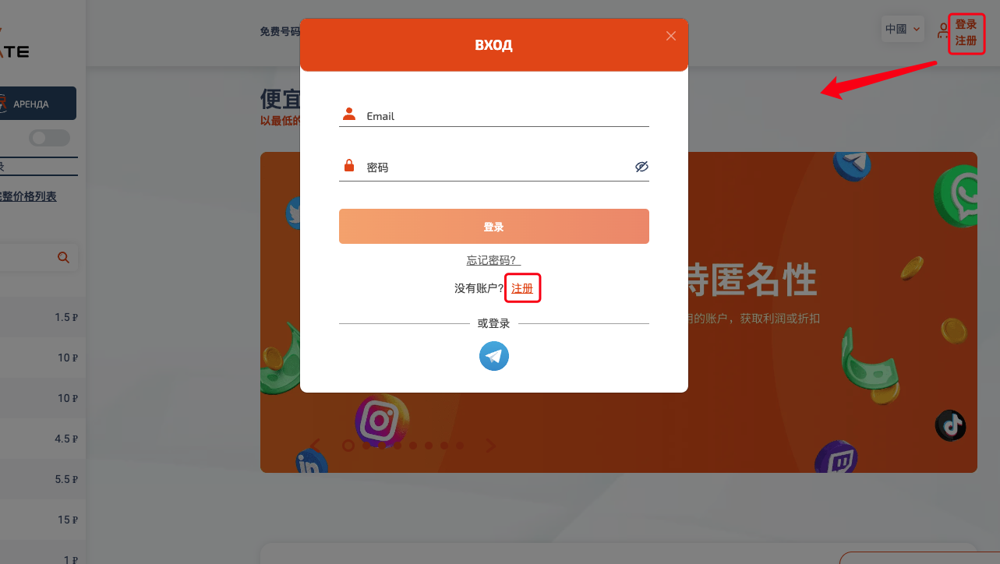
   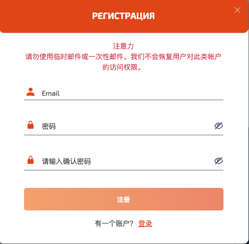

7. 邮箱中会收到一封由[SMS-ACTIVATE]发送的邮件，主题一般是【确认电子邮件来注册SMS-Activate账户】，打开邮件点击确认按钮完成注册。
   
   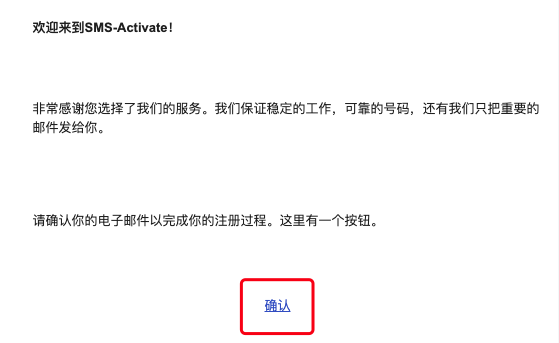

8. 点击上一步的注册按钮后，浏览器会自动跳转到接码平台主页面，点击右上角余额，在弹出的页面中找到支付宝充值1美元，后续的花费基本就够用了。
   
   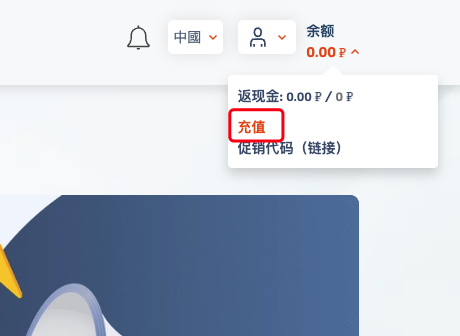
   

9. 充值完成后会跳转回主页面，在左侧的服务列表中找到OpenAI，如果没有的话，可以使用搜索框查找OpenAI，点击OpenAI会展开支持国家列表，我们选择一个价格合适的点击后方购物车进行购买，购买时会自动从你的余额中扣除费用。

   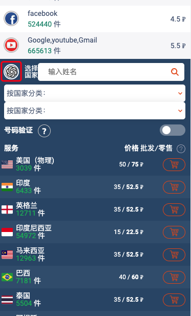

10. 购买后会打开已购买页面，可以看到自己的电话号码和使用时限
    
    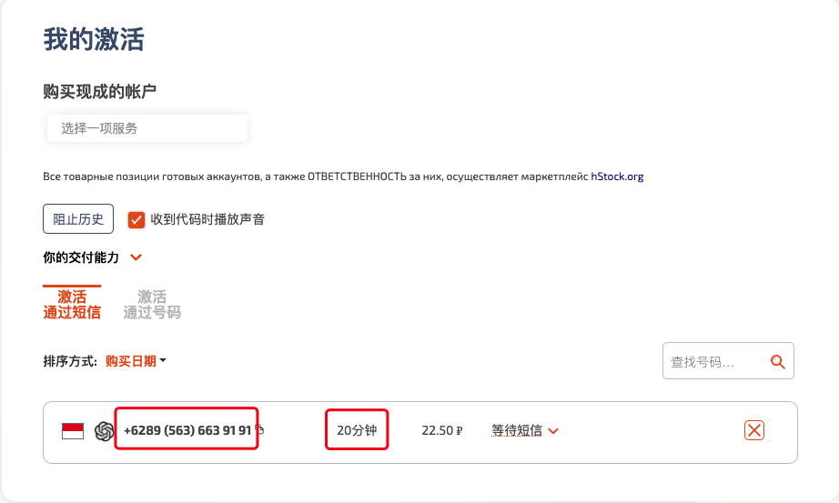
    
    这个时候就要尽快去刚才OpenAI的注册页面，选择自己选择的国家并输入电话号码，发送短信验证码。注意，页面上的是否拥有WhatsApp 要选择 NO
    
    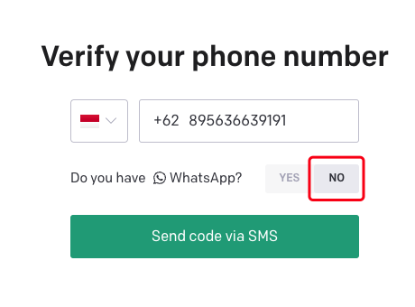

11. 我们回到接码平台的已购买页面，会发现刚才的号码后面已经出现了验证码，我们把这个验证码输入到OpenAI的验证码输入框中，输入进去后，页面会自动进行验证。
    
    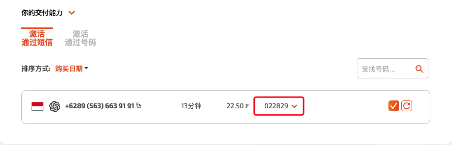
    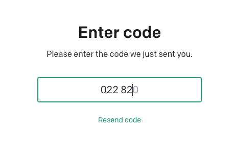

12. 如果验证成功，那么恭喜你，你已经拥有了一个属于自己的OpenAI账号，页面也会定向到ChatGPT的对话主页面，你可以开始开启体验ChatGPT的奇妙之处了！
    
    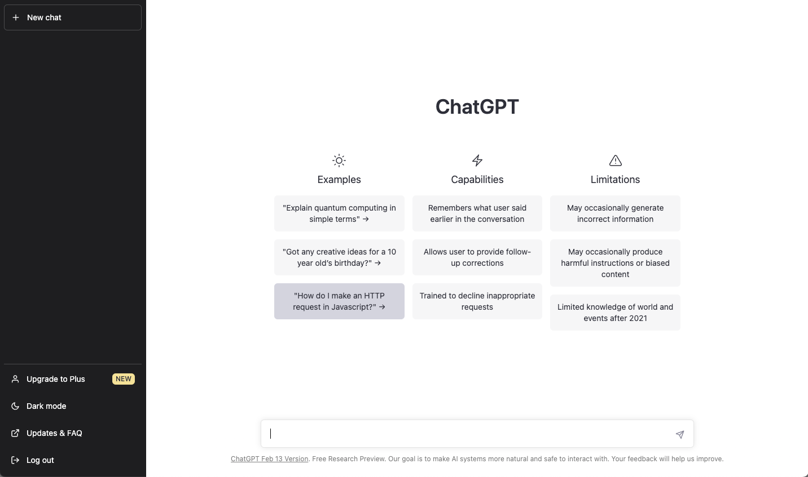
